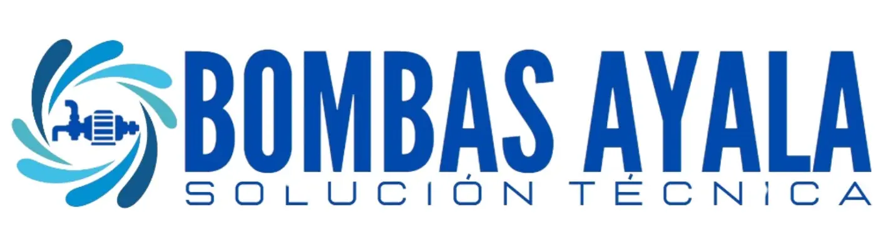

# 🔧 Bombas Ayala - Solución Técnica



## 📋 Descripción del Proyecto

**Bombas Ayala** es una empresa peruana especializada en sistemas de bombeo y plomería con más de **25 años de experiencia** en el mercado. Este proyecto consiste en el sitio web corporativo que presenta los servicios, productos y información de contacto de la empresa.

La empresa se dedica a brindar soluciones técnicas profesionales en el sector de bombas de agua y plomería en general, con reconocida experiencia y calidad comprobada.

## 🏢 Información de la Empresa

### Misión
Brindar soluciones eficientes, seguras y de alta calidad en sistemas de bombeo y plomería, satisfaciendo las necesidades de nuestros clientes a través de un servicio confiable, profesional y respaldado por más de dos décadas de experiencia.

### Visión
Ser la empresa líder en servicios de bombeo en Lima con cobertura completa, reconocida por la excelencia en nuestro trabajo, la satisfacción de nuestros clientes y la calidad en nuestras soluciones óptimas.

## 🛠️ Servicios Principales

### ⭐ Servicios Destacados
- **Mantenimiento, instalación y venta de bombas de agua**
- **Tableros variadores de velocidad**

### 🔧 Servicios Especializados
- Limpieza de cisternas y tanques elevados
- Limpieza de pozos sépticos
- Limpieza de piscinas
- Mantenimiento de termas
- Gasfitería en general
- **Atención de emergencias 24/7** 🚨

### ⚡ Tiempos de Respuesta
- **Emergencias**: 15-30 minutos
- **Citas Programadas**: Mismo día o siguiente

## 📞 Información de Contacto

- **WhatsApp**: [+51 997 984 102](https://wa.me/51997984102)
- **Teléfono**: +51 986 186 297
- **Email**: bombasayala365@gmail.com

### 🌐 Redes Sociales
- Facebook
- LinkedIn
- YouTube

## 💻 Estructura del Proyecto

```
BombasAyala/
├── index.html              # Página principal
├── nosotros.html           # Información de la empresa
├── servicios.html          # Catálogo de servicios
├── productos.html          # Productos disponibles
├── contactos.html          # Información de contacto
├── soporte.html           # Soporte técnico
├── fotos.html             # Galería de proyectos
├── build/                 # Archivos compilados
│   ├── css/              # Estilos CSS
│   ├── js/               # Scripts JavaScript
│   └── img/              # Imágenes optimizadas
└── README.md             # Este archivo
```

## 🎨 Características del Sitio Web

### Páginas Principales
1. **Inicio** (`index.html`) - Presentación principal con servicios destacados
2. **Nosotros** (`nosotros.html`) - Historia, misión, visión y valores
3. **Servicios** (`servicios.html`) - Catálogo completo de servicios
4. **Productos** (`productos.html`) - Productos y equipos disponibles
5. **Contacto** (`contactos.html`) - Formulario de contacto e información
6. **Soporte** (`soporte.html`) - Soporte técnico y contacto directo
7. **Fotos** (`fotos.html`) - Galería de proyectos realizados

### Funcionalidades
- ✅ Diseño responsive (móvil, tablet, desktop)
- ✅ Navegación intuitiva con menú hamburguesa móvil
- ✅ Formulario de contacto
- ✅ Galería de proyectos con filtros
- ✅ Botones de contacto directo (WhatsApp, llamadas)
- ✅ Información de contacto siempre visible
- ✅ Optimización de imágenes (WebP)

## 🚀 Tecnologías Utilizadas

- **HTML5** - Estructura semántica
- **CSS3** - Estilos y diseño responsive
- **JavaScript** - Interactividad y funcionalidades
- **WebP** - Optimización de imágenes
- **Font Awesome** - Iconografía

## 📱 Compatibilidad

El sitio web está optimizado para:
- ✅ Dispositivos móviles (smartphones)
- ✅ Tablets
- ✅ Computadoras de escritorio
- ✅ Navegadores modernos (Chrome, Firefox, Safari, Edge)

## 🏆 Ventajas Competitivas

- **Más de 25 años de experiencia**
- **Atención 24/7 para emergencias**
- **Respuesta rápida (15-30 minutos en emergencias)**
- **Cobertura completa en Lima**
- **Compromiso con la calidad**
- **Servicio profesional y confiable**

## 📋 Cómo Usar

1. Abrir `index.html` en un navegador web
2. Navegar por las diferentes secciones usando el menú
3. Contactar directamente a través de WhatsApp o teléfono
4. Revisar la galería de proyectos en la sección "Fotos"
5. Completar el formulario de contacto para solicitar servicios

## 🔧 Mantenimiento

El sitio incluye:
- Imágenes optimizadas en formato WebP
- CSS y JavaScript minificados en la carpeta `build/`
- Estructura modular para fácil mantenimiento
- Código limpio y comentado

---

**© 2024 Bombas Ayala - Solución Técnica** | Todos los derechos reservados

*Empresa especializada en bombas de agua y plomería - Lima, Perú*